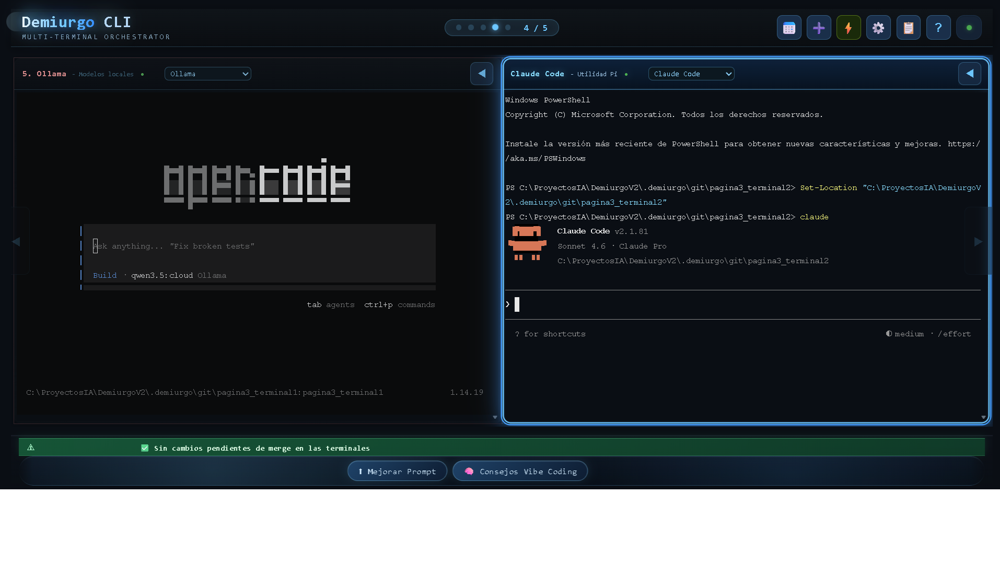

<!-- Shields.io badges -->


# Demiurgo CLI

## Description

Demiurgo CLI is a professional-grade multi-terminal orchestration framework designed to streamline high-productivity AI development workflows on Windows. It fills a unique market gap by combining parallel AI terminals, Git Worktree automation, local voice input, robust Windows process isolation, and sophisticated agent orchestration within a unified, high-performance desktop environment.

It empowers individual Windows developers using multiple AI CLIs (such as Claude Code, Copilot, OpenCode, Ollama, Kilo, and Pi) who require shared context, parallel Git branches, and local automation to eliminate friction from their "vibe coding" experience.


## Features

*   **Multi-Terminal AI Orchestration**: Seamlessly manage up to 6 parallel AI-specialized terminal sessions (Codex, Kilo, Copilot, OpenCode, Ollama, Pi) within a customizable and high-performance UI.
*   **Intelligent Agent Collaboration**: Agents communicate and delegate tasks using a JSON-RPC 2.0 protocol over a central EventBus, enabling complex multi-agent workflows including delegation, peer review, and task rescue.
*   **Robust Git Worktree Automation**: Provides high-performance branch management for concurrent context switching, including automated merge-to-main logic, snapshots, and mutex-protected Git operations.
*   **Resource Lifecycle Management**: Leverages native Windows Job Objects for strict process lifecycle enforcement, reliable cleanup, and memory limitation, preventing rogue processes from consuming excessive resources.
*   **Context-Aware Persistence (Portable Brain)**: Features a sophisticated memory system including `personal` preferences, `working` task state, `episodic` experience logs, and `semantic` distilled lessons, all managed via a `ContextProvider` and `SharedMemory` to inject relevant knowledge proactively.
*   **Local Voice Input**: Integrated Whisper tiny model via Transformers.js for local Speech-to-Text (STT) capabilities, enabling voice commands without external server dependencies.
*   **CLI Tool Management**: Centralized detection, caching, and management of installed CLI tools, simplifying the setup and configuration of AI agents.
*   **Daily Planner & Workflow Orchestrator**: Tools for defining daily missions, managing tasks, and orchestrating complex multi-step workflows.
*   **Data Layer & Flywheel**: Local-first monitoring and analytics for agent activity, performance, and resource usage, with export capabilities for traces, context cards, and eval cases.
*   **Extensible Skill System**: Agents can load skills dynamically based on task triggers and preconditions, with self-rewrite hooks for continuous improvement.



## Installation

To get Demiurgo CLI up and running on your local machine, follow these steps:

1.  **Clone the Repository**:
    ```bash
    git clone https://github.com/JED78/demiurgo-v3.git # Replace with actual repo URL if different
    cd demiurgo-v3
    ```
2.  **Install Dependencies**:
    ```bash
    npm install
    ```
3.  **Ensure Windows Environment**: Demiurgo CLI's core functionalities (PTY, Job Objects) are Windows-specific. Ensure you are running on Windows 10 (build 18362+) or Windows 11 for full compatibility.

### Global Installation (Windows)

To make the `demiurgo` command available from any directory in your terminal:

```powershell
powershell -ExecutionPolicy Bypass -File .\\scripts\\install-global.ps1
```

## Usage

Demiurgo CLI can be launched as a full Electron application with a GUI or as a headless backend daemon.

### Launch Full Application (Electron + Server)

This command starts the Electron GUI along with the backend server, providing the full multi-terminal experience.

```bash
npm start
```

### Launch Backend Daemon Only

For headless operation or to run the agent orchestration in the background, you can start only the daemon. Note that `DEMIURGO_TOKEN` environment variable is required for daemon mode.

```bash
node bin/demiurgo.js --daemon --port 3000 --token your_secret_token
```

Replace `your_secret_token` with a strong, unique token.

### Inter-Agent Delegation Example

A core capability of Demiurgo CLI is its ability to orchestrate tasks between specialized AI agents. Below is a critical snippet demonstrating how an `AutomationAgent` might delegate a command execution task to a `CommandAgent` using the Dependency Injection (DI) container's `ask` method. This showcases the JSON-RPC-like inter-agent communication.

```javascript
// From test/agent-integration.test.js - Demonstrates inter-agent delegation
// AutomationAgent asks CommandAgent to execute a command via diContainer.ask
await t.test('Inter-agent delegation: Automation asks Command to execute', async () => {
  const result = await diContainer.ask('command', 'execute:command', { 
    sessionId: 'test-session', 
    cmd: 'echo "hello from automation"' 
  });
  
  assert.ok(result.success);
  assert.match(result.output, /hello from automation/);
});
```

This snippet highlights the `diContainer.ask` pattern, which is central to how agents request services from each other, abstracting away the underlying communication details and enabling robust, asynchronous collaboration.

## Tech Stack

Demiurgo CLI is built upon a modern and robust technology stack:

*   **Runtime**: Node.js (v18.x, 20.x)
*   **Desktop Container**: Electron (v41.2.0)
*   **Terminal Emulation**: xterm.js (v6.0.0) with `@xterm/addon-fit`
*   **Process Management (Windows)**: node-pty (v1.1.0) and native Windows Job Objects
*   **Real-time Communication**: WebSocket (ws v8.20.0)
*   **AI Integration**: OpenAI (v6.39.0) and Anthropic via `llm.py` in `.agent/harness/`, Transformers.js (`@xenova/transformers` v2.17.2) for Whisper STT.
*   **Database**: SQLite3 (sqlite3 v6.0.1) for agent memory and history.
*   **Configuration**: dotenv (v16.4.5) for environment variables, JSON-based persistent config files.
*   **UI Components**: Lucide icons (lucide v1.14.0), Vanilla JavaScript and CSS (framework-less for performance).
*   **Development Tools**: ESLint (`@eslint/js` v10.0.1, `eslint` v10.4.0) for linting, c8 (v11.0.0) for test coverage, `node --test` for unit testing.


## API

Demiurgo CLI utilizes a layered communication architecture to facilitate interaction between its UI, backend services, and AI agents.

### 1. WebSocket Protocol (Port 3000)

All real-time communication between the UI (Electron Renderer process) and the Backend (Node.js Server) is handled via WebSocket.

**Outgoing (UI -> Backend)**
*   `create-session`: Spawns a new PTY terminal session.
    ```json
    { "type": "create-session", "sessionId": "codex", "cmd": "claude", "cwd": "C:/...", "shell": "powershell.exe" }
    ```
*   `input`: Sends text input to a specific terminal session.
    ```json
    { "type": "input", "sessionId": "codex", "text": "ls\\r" }
    ```
*   `resize`: Resizes a terminal session to new dimensions.
    ```json
    { "type": "resize", "sessionId": "codex", "cols": 120, "rows": 40 }
    ```
*   `agent:command`: Invokes an action on a Command Agent.
    ```json
    { "type": "agent:command", "action": "execute", "params": { "command": "git status" } }
    ```

**Incoming (Backend -> UI)**
*   `output`: Streams terminal output data in real-time.
    ```json
    { "type": "output", "sessionId": "codex", "text": "..." }
    ```
*   `status`: Provides lifecycle updates for terminal sessions (e.g., `connected`, `disconnected`).
    ```json
    { "type": "status", "sessionId": "codex", "status": "connected | disconnected" }
    ```
*   `branch-status`: Delivers Git branch status updates, including `ahead`, `behind`, and `diffCount` information.
    ```json
    { "type": "branch-status", "sessionId": "codex", "branchName": "feature-x", "ahead": 0, "behind": 2 }
    ```
*   `log`: Broadcasts system-wide log messages for debugging and monitoring.
    ```json
    { "type": "log", "level": "info", "message": "Client connected to Demiurgo CLI" }
    ```

### 2. Inter-Agent Communication (JSON-RPC 2.0 over EventBus)

Agents within the backend communicate with each other using a JSON-RPC 2.0-like format routed through a central `EventBus` and `DIContainer`. This enables structured delegation and task coordination.

**Request Structure**:
```json
{
  "jsonrpc": "2.0",
  "method": "ask",
  "params": {
    "fromAgent": "string (agentId)",
    "toAgent": "string (agentId or capability)",
    "task": "string | object (instruction or structured task)",
    "context": "object (optional contextual data)"
  },
  "id": "string (unique requestId)"
}
```

**Response Structure**:
```json
{
  "jsonrpc": "2.0",
  "result": "object (output of the task)",
  "error": "object (optional error information)",
  "id": "string (matching requestId)"
}
```

### 3. HTTP API (Port 3000)

The backend server exposes a minimal HTTP API for specific functionalities, primarily for handling large data payloads (artifacts).

*   `GET /api/artifacts/:id`: Retrieves generated artifacts (e.g., large logs, images, files) by their unique ID.
*   `DELETE /api/terminal-log/:sessionId`: Clears the stored input logs for a specific terminal session.
*   `GET /api/health`: Health check endpoint for server status.

### 4. Electron IPC (Main <-> Renderer)

For secure communication between the Electron Main process and the Renderer process, a context bridge (`preload.js`) exposes a limited set of functionalities.

**Exposed via `window.electronAPI`**:
*   `loadAiConfig() / saveAiConfig(config)`: Manage AI agent configuration.
*   `loadDailyPlannerConfig() / saveDailyPlannerConfig(config)`: Manage the daily planner state.
*   `listWorkflows() / loadWorkflow(fileName) / saveWorkflow(payload) / deleteWorkflow(fileName)`: Workflow management.
*   `listInstalledCliPackages() / installCliPackage(packageName) / uninstallCliPackage(packageName)`: CLI tool management.
*   `readClipboardText() / writeClipboardText(text)`: Clipboard access.
*   `logAppError(payload)`: Logs application errors to a central file.
*   `transcribeSpeechAudio(payload)`: Sends audio data for transcription using the local Whisper model.
*   `openFolderInExplorer(targetPath)`: Opens a given path in the system's file explorer.


### Development Flow:
*   **Layered Architecture**: Respect the project's layered structure (`src/server/` for backend, `src/ui/` for frontend, `src/electron/` for Electron-specific logic).
*   **Code Standards**: Ensure your code adheres to ESLint rules (`npm run lint`) and passes all tests (`npm test`).
*   **Pull Requests**: Provide clear descriptions of your changes and the problems they solve.

## License

The project is licensed under the MIT License.
